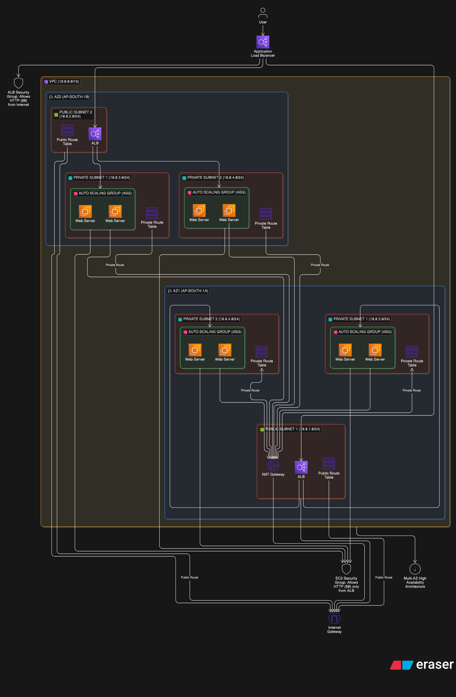

# 🚀 AWS High Availability Web Architecture

This project demonstrates how to build a **highly available, scalable web architecture on AWS** using core networking and compute services.

---

## 📌 Architecture Overview

This setup includes:

- Custom VPC
- Public & Private Subnets (Multi-AZ)
- Internet Gateway & NAT Gateway
- Route Tables
- Security Groups
- EC2 Instances (private)
- Auto Scaling Group (ASG)
- Application Load Balancer (ALB)

---

## 🏗️ Architecture Diagram



---

## ⚙️ Step-by-Step Implementation

### 1. Create VPC

- Name: `ha-vpc`
- CIDR: `10.0.0.0/16`

---

### 2. Enable DNS Hostnames

- Enabled for proper internal resolution

---

### 3. Create Subnets

| Name             | CIDR        | AZ  | Type    |
| ---------------- | ----------- | --- | ------- |
| public-subnet-1  | 10.0.1.0/24 | AZ1 | Public  |
| public-subnet-2  | 10.0.2.0/24 | AZ2 | Public  |
| private-subnet-1 | 10.0.3.0/24 | AZ1 | Private |
| private-subnet-2 | 10.0.4.0/24 | AZ2 | Private |

✔ Enabled auto-assign public IP for public subnets

---

### 4. Internet Gateway

- Created `ha-igw`
- Attached to VPC

---

### 5. NAT Gateway

- Created in public subnet
- Elastic IP allocated
- Enables outbound internet for private instances

---

### 6. Route Tables

#### Public Route Table

- Route: `0.0.0.0/0 → Internet Gateway`
- Associated with public subnets

#### Private Route Table

- Route: `0.0.0.0/0 → NAT Gateway`
- Associated with private subnets

---

### 7. Security Groups

#### ALB Security Group (`alb-sg`)

- Allow HTTP (80) from anywhere

#### EC2 Security Group (`ec2-sg`)

- Allow HTTP (80) only from ALB

---

### 8. EC2 Instance

- Amazon Linux 2
- Instance type: `t3.micro`
- Placed in private subnet

#### User Data Script

```bash
#!/bin/bash
yum install -y httpd
systemctl start httpd
echo "Healthy from $(hostname)" > /var/www/html/index.html
```

---

### 9. Auto Scaling Group

- Launch Template: `web-lt`
- Desired: 2
- Min: 2
- Max: 4
- Subnets: Private subnets

---

### 10. Application Load Balancer

- Internet-facing
- Attached to public subnets
- Connected to target group (`web-tg`)

---

### 11. Validation

Access the ALB DNS URL in browser:

```
Healthy from ip-10-0-x-x
```

---

## Key Learnings

- VPC design and subnetting
- High availability using Multi-AZ
- Secure architecture using private subnets
- Load balancing and scaling
- Real-world cloud architecture design

---

## 👨‍💻 Author

Kavya

---
